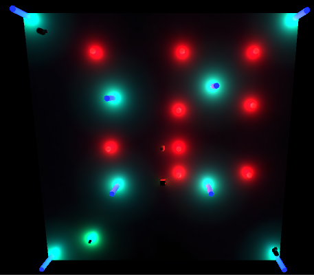

<html>
<meta name="viewport" content="width=device-width, initial-scale=1">
<header>
    <h1>Project Site</h1>
</header>

    <!--Png Functions better than GIF as it allows for more colors and offers better compression ratios-->
<body>
    <h1>School Projects</h1>
    <h2>Website</h2>
    
 This was a project done for class where we made websites using HTML. I made the website with the main goal of informing the reader about the game series starcraft. <a href ="https://github.com/Themarineguy101/TestSite/tree/master/Starcraft%20series%20website%20-%20Copy">Link to the code in github is here</a>

    
    <h2>Card Game</h2>
    
 This was a project done for class where we made, using netbeans to make a game where one guesses if the next card would be a higher or lower value. <a href ="https://github.com/Themarineguy101/TestSite/tree/master/CardGameTesting">Link to the code in github is here</a>

    
<h1>Projects</h1>
<h2>Java Calculator</h2>
    
This is a calculator I developed using java, capable of a decent amount of operations, soch as log, square root, squared, the basic operations, Cosh, and some other operations.<a href ="https://github.com/Themarineguy101/TestSite/tree/master/Java_Project_Scientific_Calculator">Link to the code in github is here</a>

    
<h2>Video Game Factions</h2>
    
This is a database I made which holdes three lonked tables that hold game, mod, and faction data, developed through Microsoft SQL Server Management Studio. <a href ="https://github.com/Themarineguy101/TestSite/tree/master/Table_Test">Link to the code in github is here</a>. <a href ="https://databasedeploy.azurewebsites.net/Game/Game">Here is a link that can directly show the contents of said table</a>.

    
<h2>Wizard Wars</h2>

This is a top down shooting game I made using Unity and C#, made mainly for local 2 player vs, and a single player challenge mode. Besides the music, sound effects, and the base movement script for the characters I largely done it through research and experimentation, making a lightbased shooter with a variety of power-ups revolving around the use of light to both find and hide. <a href ="https://github.com/Themarineguy101/TestSite/tree/master/Script">Link to the C# files for the game,</a> though not all of the code is incorperated into the project, like the bounce projectile. <a href ="https://github.com/Themarineguy101/TestSite/tree/master/WizardDuelGame.zip">Here is a link to the compressed game files that you can download</a>, then extract to play on the computer.

    
    
<a href =https://github.com/Themarineguy101/TestSite/blob/master/Computer%20Programming%20Internship%20Project%20Presentation.pptx>This link will bring you to the powerpoint presentation that covers thi page and it's contents</a>

</body>
</html>
