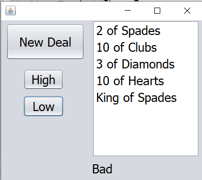
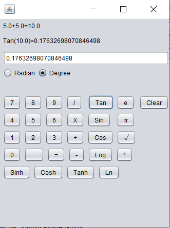

<html>
<meta name="viewport" content="width=device-width, initial-scale=1">
<header>
    <h1>Project Site</h1>
</header>

    <!--Png Functions better than GIF as it allows for more colors and offers better compression ratios-->
<body>
    <h1>School Projects</h1>
    <h2>Website</h2>
    
 This was a project done for class where we made websites using HTML. I made the website with the main goal of informing the reader about the game series starcraft. <a href ="https://github.com/Themarineguy101/TestSite/tree/master/Starcraft%20series%20website%20-%20Copy">Link to the code in github is here</a>

    
    <h2>Card Game</h2>
    
 This was a project done for class where we made, using netbeans to make a game where one guesses if the next card would be a higher or lower value. <a href ="https://github.com/Themarineguy101/TestSite/tree/master/CardGameTesting">Link to the code in github is here</a>

    
<h1>Projects</h1>
<h2>Java Calculator</h2>
    
This is a calculator I developed using java, capable of a decent amount of operations, soch as log, square root, squared, the basic operations, Cosh, and some other operations.<a href ="https://github.com/Themarineguy101/TestSite/tree/master/Java_Project_Scientific_Calculator">Link to the code in github is here</a>

    
<h2>Video Game Factions</h2>
<h2>Wizard Wars</h2>

</body>
</html>
